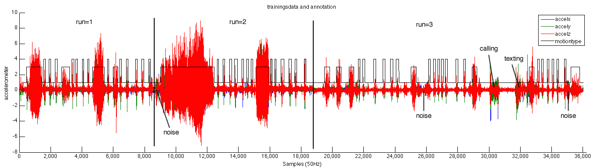
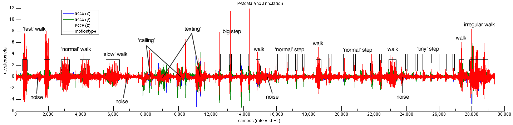
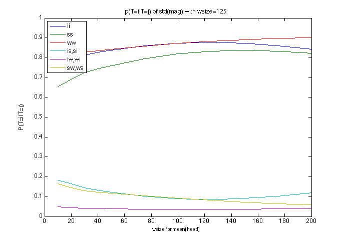
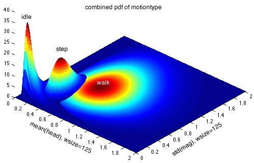
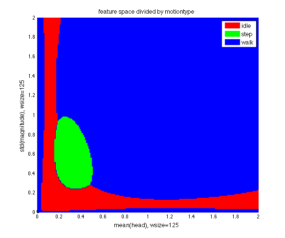

# Index:
- ..
- ..
- ..
- ..

# k-NN

Using the features determined in [pdfComparison](pdfComparison.md), we are able to apply k-NN to a dataset and see how well the features and k-NN work for classification.

## Data-sets
Data is recorded at a maximum frequency of 50Hz. The real sampling time will be a bit slower (~49.8Hz), due to scheduling and decision made by the Android OS. 

Training and testing data is done with different datasets. Each described in the next sections.

### Training
The trainings data consists of 3 'runs' (that is, 3 differenct recordings). Each run contains a different sequence of samples and activity, where each sample is manually (in the app) annotated. Using matlab, the annotation of data data is corrected where needed in order to minimise the noise. This correction is done manually.

Below an overview of the full 3-run dataset is shown.

The 'motiontype' line describes the annotated activity:
- 1: idle
- 3: walk
- 4: step

Some statistics of the dataset:

| statistic       | value  |
| --------------- | ------ |
| #runs           | 3      |
| #samples (all)  | 36016 (732s) |
| #samples run=1  | 8369 (174s) |
| #samples run=2  | 10373 (209s) |
| #samples run=3  | 17274 (349s) |
| #samples (idle) | 20742 (422s) |
| #samples (step) | 5715 (116s) |
| #samples (walk) | 9308 (189s) |
| #steps          | 46 |
| #walks          | 13 |

From the graph several noise observations can be maded. Noise is inserted to check the robustness. There are also 2 activties of calling and texting inserted:
- Calling is the action where the phone is moved towards the ear and after some time returned to the original position.
- Texting is the action where the phone is rated to landscape-mode, moved a bit (vivid texting!) and returned to portrait after a while.
Ideally, kNN should classify these activities (when observed in the trainingsset) as 'idle', since they are regarded as noise in our system.

### Test

To determine how well we can classify samples and determine the average queueing and serving time, a test set has been recorded with several type op motions. Below an annoted version of the 1-run dataset is shown.

| statistic       | value  |
| --------------- | ------ |
| #runs           | 1      |
| #samples (all)  | 29397 (593s) |
| #samples (idle) | 21355 (430s) |
| #samples (step) | 2927 (59s)   |
| #samples (walk) | 5115 (104)s) |
| #steps          | 21 |
| #walks          | 10 |

Several different steps and walks are recorded. By differentiating the speed of such an activity, different accelerometer values will be observed. The amount of correctly classified samples will give insight in how well the selected features perfom in terms of classification.

From the graph several noise observations can be maded. Noise is inserted to check the robustness. There are also 2 activties of calling and texting inserted:
- Calling is the action where the phone is moved towards the ear and after some time returned to the original position.
- Texting is the action where the phone is rated to landscape-mode, moved a bit (vivid texting!) and returned to portrait after a while.
Ideally these activities should be classified as 'noise': since they do not include a step or a walk.

## Training Data

### wsize and offset
From [pdfComparison](pdfComparison.md) we have determined that the standard deviation of the magnitude with an windowsize of 125 samples (2.5 seconds) and the mean of the heading (200 samples) results in the highest clasification probabilties:

| feature    | P(T=1|T=1) | P(T=2|T=1) | P(T=3|T=1) | P(T=1|T=2) | P(T=2|T=2) | P(T=3|T=2) | P(T=1|T=3) | P(T=2|T=3) | P(T=3|T=3) |
| ---------- | ---------- | ---------- | ---------- | ---------- | ---------- | ---------- | ---------- | ---------- | ---------- |
| std(mag)   | 0.7874     | 0.1309     | 0.0817     | 0.1309     | 0.6100     | 0.2591     | 0.0817     | 0.2591     | 0.6592     |
| mean(head) | 0.7840     | 0.1738     | 0.0422     | 0.1738     | 0.7038     | 0.1224     | 0.0422     | 0.1224     | 0.8353     |

As stated in the comparison document, the type of a feature is determined by the highest number of occuerences of a motiontype within the given windowsize. Since different windowsizes are used, the determined type per feature may differ, so an approach to determine the motiontype of a sample (feature set) needs to be developed.

Determining the motion type of a feature of sample 'i' is done by comparing all feature-values in the sliding window 'i:i+wsize'. If the sliding window encounters a minimum of '(wsize/2) + 1' motiontypes in its window, the motiontype of the feature of sample 'i' is set to that type. This mechanism ensures that a sample which is more similiar to a certain motion (has an higher amount of samples of that that motion in its window), is classified as that motion and hence, reduces the probability of misclassification. A side effect of this mechanism is that the if a sample at position j is annotated as a certain motion, the slidingwindow assigns this motion to the sample at location 'j-wsize/2', hence shifting all data (creating an offset) 'wsize/2' samples to the left (earlier in time).

Using a feature set for which each feature has different windowsize, hence results in different offsets. A proper way of correcting this offset in such a way that the error is smallest, an average 'wsize' is calculated. Using this average 'wsize' the annotated motion type is shifted 'wsize/2' samples to the left. This introduces some errors in some features, but minimizes the combined error of all features.

Using a 'wsize' of 200 and 125, the offset becomes: '(200+125)/4 = 81.25 ~ 81', resulting in the type assignment: 'sample_type(i) = sample_type(i+81)'

Since the combined motiontype assignment differs from the assignment used to calculate the pdfs, the pdfs change. Below the distributions with an fixed offset of 81 is shown for a standard deviation with 'wsize=125' and a mean of the heading with a 'wsize=200'.

| feature    | P(T=1|T=1) | P(T=2|T=1) | P(T=3|T=1) | P(T=1|T=2) | P(T=2|T=2) | P(T=3|T=2) | P(T=1|T=3) | P(T=2|T=3) | P(T=3|T=3) |
| ---------- | ---------- | ---------- | ---------- | ---------- | ---------- | ---------- | ---------- | ---------- | ---------- |
| std(mag)   | 0.7694     | 0.1471     | 0.0835     | 0.1471     | 0.5940     | 0.2590     | 0.0835     | 0.2590     | 0.6575     |
| mean(head) | 0.6018     | 0.3053     | 0.0928     | 0.3053     | 0.6152     | 0.0794     | 0.0928     | 0.0794     | 0.8277     |

Compared to the previous table, we see only a small change in the results of the standard deviation, but the probabilities of the mean have a dramatical change: the classification for 'idle' for example drops from 78 percent to 60!

Clearly, the chosen window size for a single feature, effects all features in the same feature set. By extending the tool developed to calculate the probability for (mis) classification by 1 dimension, we can calculate the probability for mis classificiation when 2 features are used. 

First the pdf's for each type of each feature, using their specified 'wsize' and combined offset, are calculated. For two features, this result in 3 1xN and and 3 1xM vector: for each type a 1xN (pdf of feature 1) and 1xM (pdf of feature 2) vector. These vectors can be combined by multiplication, resulting in 3 NxM matrices: showing the pdf of a motion type over the feature space of 2 features, or mathematically: 'P(X=x|T=i)', the probability of a location in this NxM matrix, given that a certain motion is observed. 

Using the same calculations described in [pdfComparison](pdfComparison.md), we can compute the probability of mis-classification in the 2D feature set. By comparing the pdf of 'std(mag)' with 'wsize=125', with and without offset, we can see that there is only a small change, indicating that this feature might be relativly stabel regarding the offset. The 'mean(head)' feature however has some large deviation. Below the probabiliy for mis-classifications are shown for 'std(mag)' with 'wsize=125' and 'mean(head)' width 'wsize=[10 20 30 40 50 75 100 125 150 175 200]'

| wsize (std) | wsize (mean) | offset | P(T=1|T=1) | P(T=2|T=1) | P(T=3|T=1) | P(T=1|T=2) | P(T=2|T=2) | P(T=3|T=2) | P(T=1|T=3) | P(T=2|T=3) | P(T=3|T=3) |
| ----------- | ------------ | ------ |----------- | ---------- | ---------- | ---------- | ---------- | ---------- | ---------- | ---------- | ---------- |
| 125         | 10           | 34     | 0.7687     | 0.1816     | 0.0496     | 0.1816     | 0.6539     | 0.1645     | 0.0496     | 0.1645     | 0.7859     |
| 125         | 20           | 36     | 0.7915     | 0.1638     | 0.0447     | 0.1638     | 0.6921     | 0.1441     | 0.0447     | 0.1441     | 0.8112     |
| 125         | 30           | 39     | 0.8119     | 0.1459     | 0.0421     | 0.1459     | 0.7240     | 0.1301     | 0.0421     | 0.1301     | 0.8277     |
| 125         | 40           | 41     | 0.8269     | 0.1324     | 0.0408     | 0.1324     | 0.7446     | 0.1230     | 0.0408     | 0.1230     | 0.8362     |
| 125         | 50           | 44     | 0.8376     | 0.1227     | 0.0397     | 0.1227     | 0.7603     | 0.1170     | 0.0397     | 0.1170     | 0.8433     |
| 125         | 75           | 50     | 0.8603     | 0.1020     | 0.0377     | 0.1020     | 0.7945     | 0.1035     | 0.0377     | 0.1035     | 0.8588     |
| 125         | 100          | 56     | 0.8738     | 0.0894     | 0.0368     | 0.0894     | 0.8190     | 0.0916     | 0.0368     | 0.0916     | 0.8716     |
| 125         | 125          | 63     | 0.8779     | 0.0856     | 0.0365     | 0.0856     | 0.8333     | 0.0811     | 0.0365     | 0.0811     | 0.8824     |
| 125         | 150          | 69     | 0.8721     | 0.0908     | 0.0371     | 0.0908     | 0.8371     | 0.0721     | 0.0371     | 0.0721     | 0.8907     |
| 125         | 175          | 75     | 0.8589     | 0.1031     | 0.0380     | 0.1031     | 0.8321     | 0.0648     | 0.0380     | 0.0648     | 0.8972     |
| 125         | 200          | 81     | 0.8413     | 0.1189     | 0.0397     | 0.1189     | 0.8215     | 0.0596     | 0.0397     | 0.0596     | 0.9007     |

As can been read in the table, the full feature set has an overall increased probability of correct classification, even reaching 90% for walk. It should however be noted that these probabilities only hold when the features are independent of each other. The larger the dependence, the less reliable the prediction for correct classidication will be. From the table it is hard to read what windowsize for 'mean(head)' should be picked, hence a graphical overview is shown below:

From which can derived that a 'wsize' of 125 (or 150) for mean(head) might be the windowsize with the best results. In order to ensure that a different windowsize for 'std(mag)' does not result in better classification, the probabilites for 'wsize = 100' and 'wsize = 150' are shown below:

| wsize (std) | wsize (mean) | offset | P(T=1|T=1) | P(T=2|T=1) | P(T=3|T=1) | P(T=1|T=2) | P(T=2|T=2) | P(T=3|T=2) | P(T=1|T=3) | P(T=2|T=3) | P(T=3|T=3) |
| ----------- | ------------ | ------ |----------- | ---------- | ---------- | ---------- | ---------- | ---------- | ---------- | ---------- | ---------- |
| 100         | 10           | 28     | 0.7874     | 0.1697     | 0.0428     | 0.1697     | 0.6511     | 0.1791     | 0.0428     | 0.1791     | 0.7780     |
| 100         | 20           | 30     | 0.8109     | 0.1504     | 0.0387     | 0.1504     | 0.6934     | 0.1561     | 0.0387     | 0.1561     | 0.8052     |
| 100         | 30           | 32     | 0.8308     | 0.1327     | 0.0365     | 0.1327     | 0.7263     | 0.1410     | 0.0365     | 0.1410     | 0.8225     |
| 100         | 40           | 35     | 0.8426     | 0.1220     | 0.0354     | 0.1220     | 0.7442     | 0.1338     | 0.0354     | 0.1338     | 0.8308     |
| 100         | 50           | 38     | 0.8518     | 0.1137     | 0.0345     | 0.1137     | 0.7587     | 0.1276     | 0.0345     | 0.1276     | 0.8379     |
| 100         | 75           | 44     | 0.8689     | 0.0980     | 0.0331     | 0.0980     | 0.7877     | 0.1143     | 0.0331     | 0.1143     | 0.8526     |
| 100         | 100          | 50     | 0.8758     | 0.0912     | 0.0330     | 0.0912     | 0.8078     | 0.1010     | 0.0330     | 0.1010     | 0.8660     |
| 100         | 125          | 56     | 0.8723     | 0.0939     | 0.0338     | 0.0939     | 0.8179     | 0.0882     | 0.0338     | 0.0882     | 0.8780     |
| 100         | 150          | 63     | 0.8594     | 0.1055     | 0.0351     | 0.1055     | 0.8168     | 0.0777     | 0.0351     | 0.0777     | 0.8873     |
| 100         | 175          | 69     | 0.8398     | 0.1234     | 0.0368     | 0.1234     | 0.8071     | 0.0694     | 0.0368     | 0.0694     | 0.8938     |
| 100         | 200          | 75     | 0.8159     | 0.1448     | 0.0393     | 0.1448     | 0.7920     | 0.0632     | 0.0393     | 0.0632     | 0.8975     |
| 150         | 10           | 40     | 0.7498     | 0.1933     | 0.0569     | 0.1933     | 0.6564     | 0.1503     | 0.0569     | 0.1503     | 0.7928     |
| 150         | 20           | 43     | 0.7728     | 0.1759     | 0.0513     | 0.1759     | 0.6922     | 0.1319     | 0.0513     | 0.1319     | 0.8168     |
| 150         | 30           | 45     | 0.7910     | 0.1606     | 0.0484     | 0.1606     | 0.7203     | 0.1191     | 0.0484     | 0.1191     | 0.8325     |
| 150         | 40           | 48     | 0.8067     | 0.1465     | 0.0469     | 0.1465     | 0.7410     | 0.1126     | 0.0469     | 0.1126     | 0.8406     |
| 150         | 50           | 50     | 0.8186     | 0.1358     | 0.0455     | 0.1358     | 0.7575     | 0.1067     | 0.0455     | 0.1067     | 0.8478     |
| 150         | 75           | 56     | 0.8422     | 0.1150     | 0.0428     | 0.1150     | 0.7910     | 0.0940     | 0.0428     | 0.0940     | 0.8632     |
| 150         | 100          | 63     | 0.8602     | 0.0984     | 0.0413     | 0.0984     | 0.8189     | 0.0827     | 0.0413     | 0.0827     | 0.8760     |
| 150         | 125          | 69     | 0.8702     | 0.0891     | 0.0407     | 0.0891     | 0.8378     | 0.0731     | 0.0407     | 0.0731     | 0.8863     |
| 150         | 150          | 75     | 0.8717     | 0.0878     | 0.0405     | 0.0878     | 0.8462     | 0.0660     | 0.0405     | 0.0660     | 0.8935     |
| 150         | 174          | 81     | 0.8637     | 0.0956     | 0.0407     | 0.0956     | 0.8449     | 0.0596     | 0.0407     | 0.0596     | 0.8997     |
| 150         | 200          | 88     | 0.8511     | 0.1072     | 0.0417     | 0.1072     | 0.8380     | 0.0549     | 0.0417     | 0.0549     | 0.9034     |

Comparing the tables, it indeed can be observed that the probabilties for mis-classification with a 'wsize' or 100 or 150 for 'std(mag)', result in higher errors compared to an 'wsize' of 125. 

Conclusion: 'wsize' for std(mag) should be 125, for mean(head) should be 125, resulting in an offset of 63 and the following probabilties:

| wsize (std) | wsize (mean) | offset | P(T=1|T=1) | P(T=2|T=1) | P(T=3|T=1) | P(T=1|T=2) | P(T=2|T=2) | P(T=3|T=2) | P(T=1|T=3) | P(T=2|T=3) | P(T=3|T=3) |
| ----------- | ------------ | ------ |----------- | ---------- | ---------- | ---------- | ---------- | ---------- | ---------- | ---------- | ---------- |
| 125         | 125          | 63     | 0.8779     | 0.0856     | 0.0365     | 0.0856     | 0.8333     | 0.0811     | 0.0365     | 0.0811     | 0.8824     |

### k-NN, distance and combined pdf

Having determined the window size for each feature, the resulting 3D image of the pdf of the complete feature space is shown below.

The motiontype 'walk' does not has a clear peek, but is smoothed out on a large portion of the feature space, while the probabilities for 'idle' and 'step' are much more concentrated.
From the combined pdf, it can be observed that both features have roughly the same domain: most values lay within the '<0,2>' bound, hence we do not have to scale any axis to compensate for the distribution density. Since the distribution is roughly equal over each feature domain, we can can use the euclidian distance for computing the nearest neighbours of a sample with k-NN.

k-NN determines the motiontype of a sample, based on the distribution of the motiontype of the k nearest neighbours. If we assume that the database used by k-NN has an infinite (or large) number of samples, plotting the samples, should result in the same pdf shown above. Perfoming a classification with this database will result in the assignment of a motiontype, for which the number of samples close by is the largest, or in other words: for which the probability of the assigned type is highest around the sample point. The motiontype with the highest probabilty equals the motiontype of which the pdf shows a larger probability over the other motiontypes. Hence, we are able to generate a 2D image showing which region is which motiontype:

Each area is constructed by combining the binairy resuls of: 'area(idle) = ((pdf(idle) > pdf(walk)) && (pdf(idle) > pdf(step))'
What is interesting to notice is that 'step' only comprehends a small area. It could be imagined that 'step' is the transition from 'idle' to 'walk', hence the the area of 'walk' and 'idle' should be isolated by 'step', which clearly is not the case. Another interesting observation is the spreading of 'idle': according to the datset 'idle' has either a low 'mean(head)' of a low 'std(magnitude)'.

## Classification 1

### unfiltered results

### filtering

### filtered results

## Classification 2

### noise correction: resampling using pdfs

### Sample distribution

### unfiltered results

### filtering

### filtered results

## Conclusion

## Discusion
