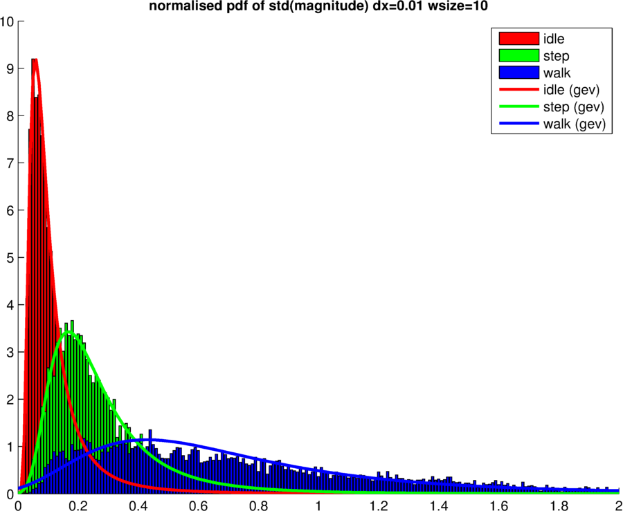
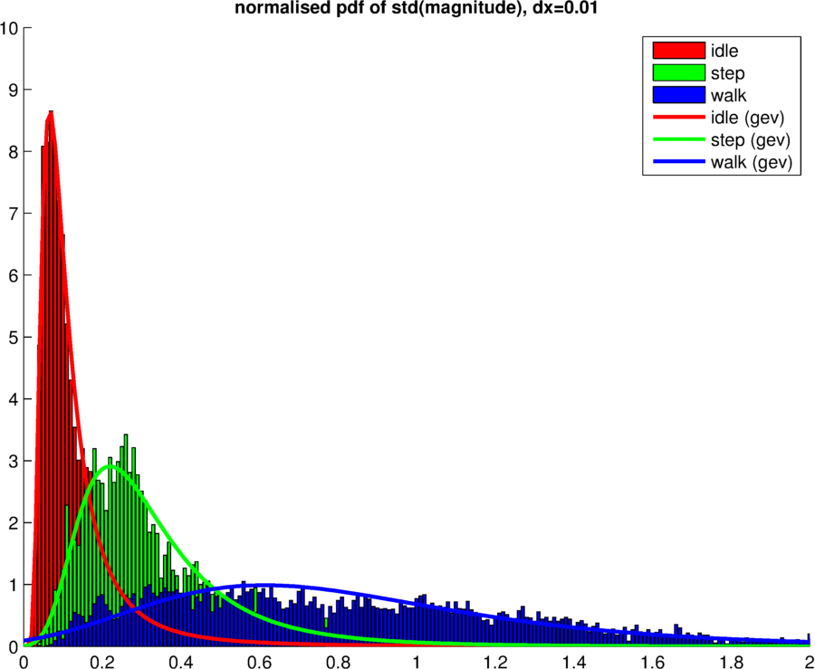
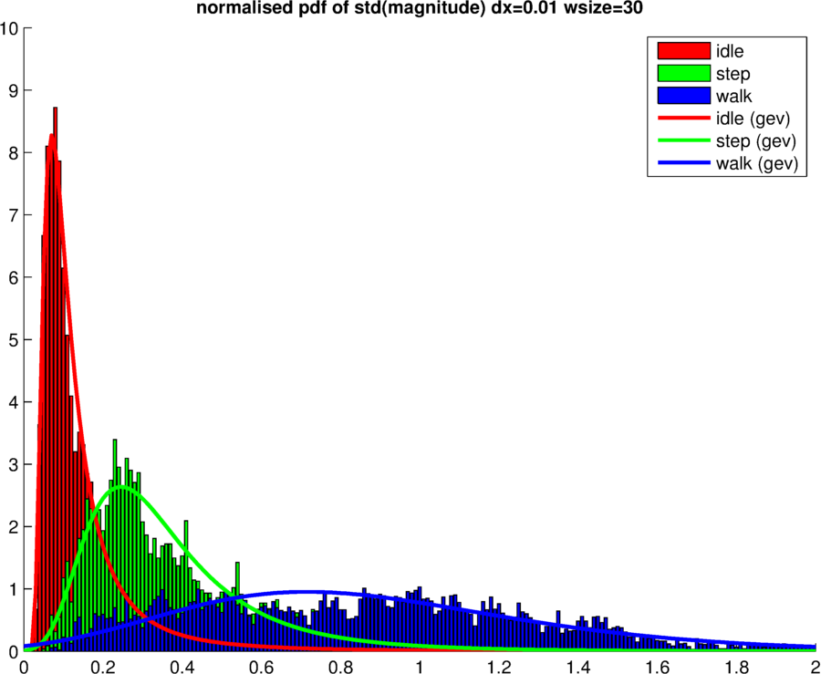
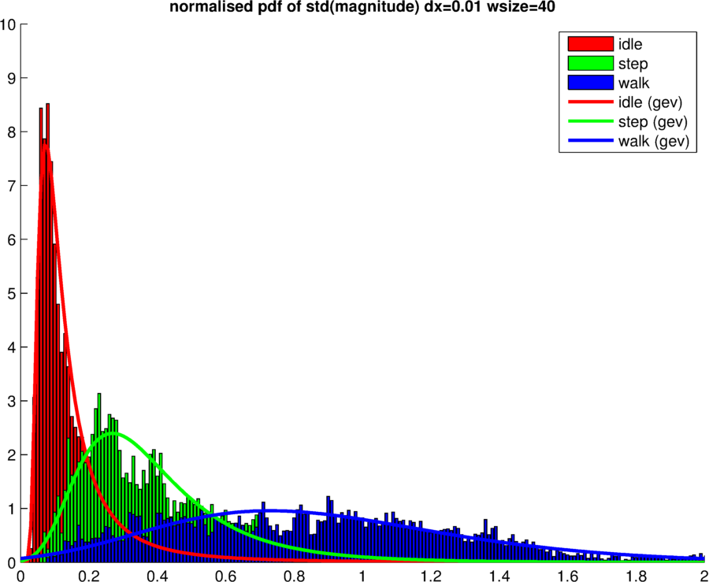
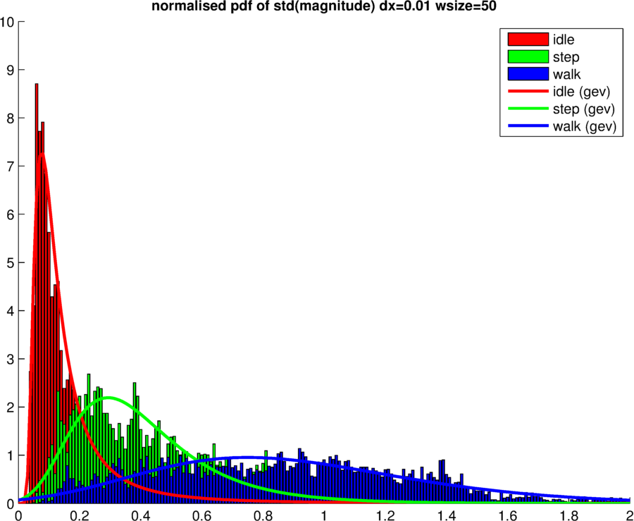
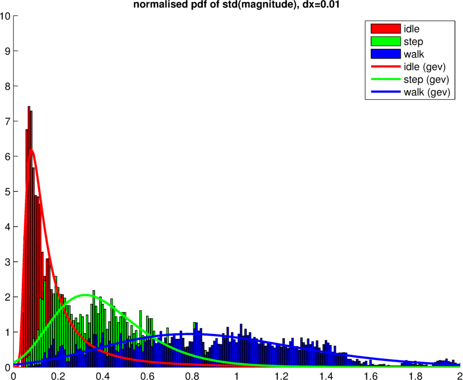
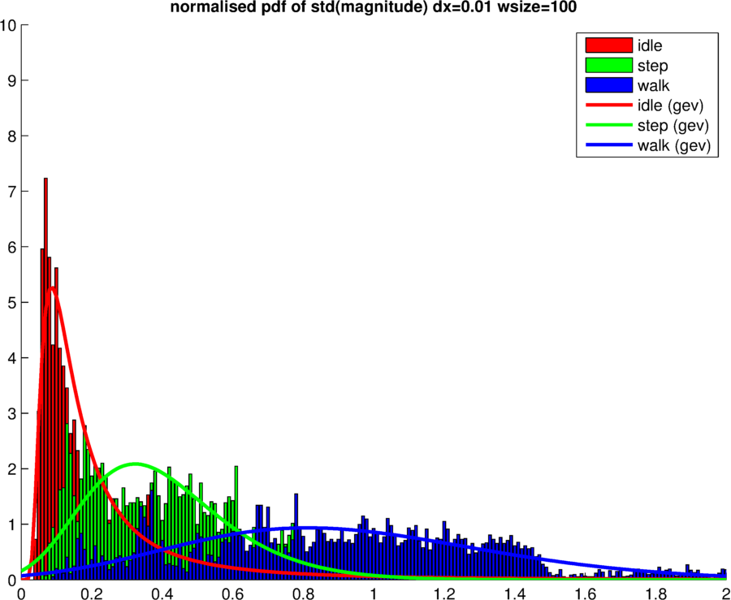
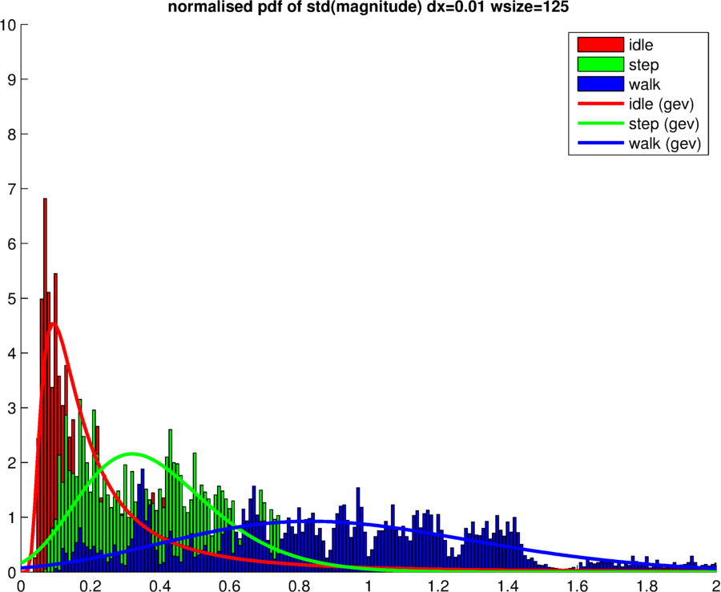
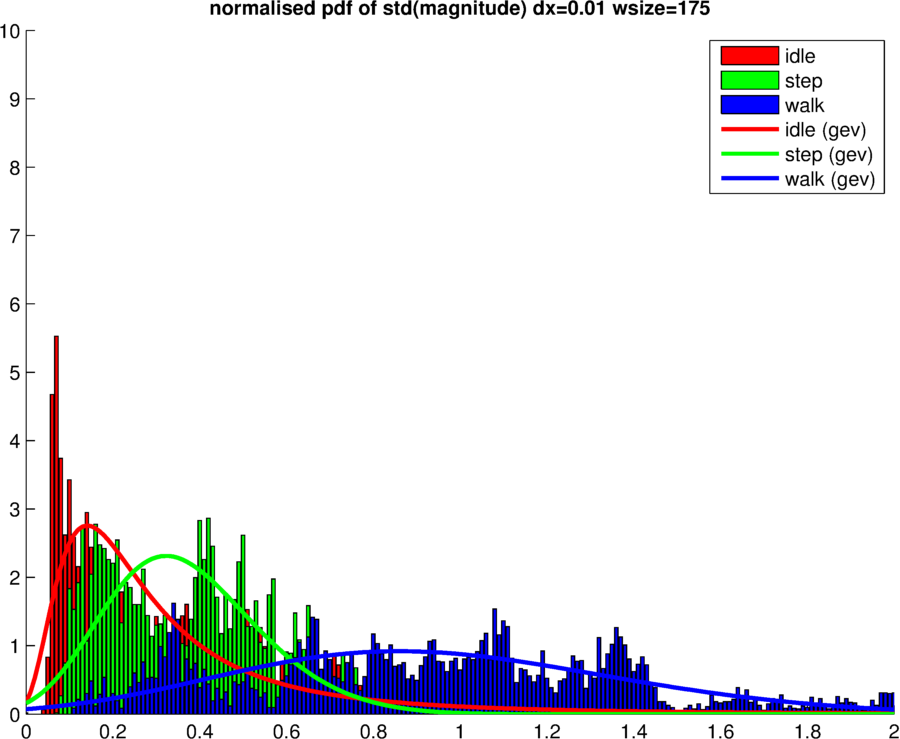
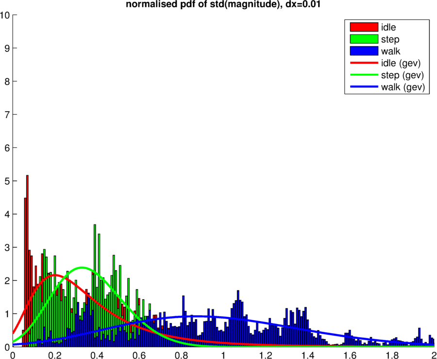

# Feature selection

One of the most challenging tasks is to select the correct features. While a trail-and-error approach might give nice results, we believe a deeper understanding of the data might result in better classification. As indicated by [A. Rai et. al. ](http://research.microsoft.com/pubs/166309/com273-chintalapudi.pdf), the mean and standard deviation of a signal gives good insights of the type of motion. One important question remains: what window-size should be taken to calculate the standard deviation on? 

Different windows-sizes result in different pdfs of. The figure below shows several pdfs of step, walk and idle given different window-sizes. 

## Data fitting
Since we are not able to observe all possible idle-, walk- and step- motions, the generated pdfs might miss some data. To smoothen our results and overcome the issue of missing data, we do a fit on the pdf. As can be observed from the previous images, a Gaussian might not fit the bill. In order to determine which distribution fit best, we make use of a function developed by Mike Sheppard: [`allfitdist`](http://www.mathworks.com/matlabcentral/fileexchange/34943-fit-all-valid-parametric-probability-distributions-to-data).


The `allfitdist` function tries to fit different distributions and returns a vector of the the top-7 best fits. We have tested several (11) windowsizes: 10, 20, 30, 40, 50, 75, 100, 125, 150, 175 and 200 samples, ranging from 1/5th of a second to a window of 4 seconds. Each windowsize generates 3 fits, one for each activity: walking, idle and step. In total, 33 fits are generated. In the table below the cumulative top-3 fit of each sample is shown.

```
>> file = '../logs/log_accelActivity1431957054688_corrected.txt'
>> sum(motiontype==1) = 20742 % idle samples
>> sum(motiontype==3) = 9308  % walk samples
>> sum(motiontype==4) = 5715  % step samples
>> testPdfFit([10 20 30 40 50 75 100 125 150 175 200], run, motiontype, magnitude)

```

|distribution                 |  1  |  2  |  3  |
| --------------------------- | --- | --- | --- |
| generalized extreme value   |  30 |  0  |  3  |
| generalized pareto          |  3  |  18 |  36 |
| tlocationscale              |  0  |  10 |  1  |
| exponential                 |  0  |  5  |  22 |
| logistic                    |  0  |  0  |  1  |


From this, it can observed that the 'generalized extreme value'-distribution might be to correct approximation for our data. It is returned as the best fit for all samples, except for the pdf of a windowsize of 10, which probably does not contain enough samples for a good fit.

By using the matlab functions `gevfit` and `gevpdf` we can now compute the probability of (mis)classification, based on a fit of the generalized extreme value distribution.

## Probability of (mis) classification

A 'good' window-size would be a width for which the probability of correct classification is high and the probability for mis-classification is low. By discretising and normalising the pdfs, these probabilities can be calculated.

First, a vector representing the x-axis is assumed to run from 0 to some value K in steps of k, resulting in K/k values. For each x-value, the corresponding y-value of each (idle, step and walk) pdf is calculated, resulting in 3 new vectors, each K/k elements long. These 4 vectors together represent the 3 histograms of each motion-type. 

Normalisation of each histogram is needed to be able to calculate the probability of (mis) classification and is done by dividing each element in the histogram by the sum of each element, multiplied by k, or in matlab notiation:

```
% hist = [K/k x 1]-vector of y-values of a pdf, calculated for each x in 0:k:K
hist_norm = hist / sum(hist*k)
```

We are looking for the probability of (mis)classification of a motiontype `T`, that is: `P(T=i|T=j)`, where `i,j = 1,2,3`, representing the motiontypes idle(1), step(2) and walk(3). Since we use a normalised histogram of a pdf, we know that each value of the histogram represents the probability that, given motiontype `j` is picked, the corresponding x-value is measured: `P(X=x|T=j)`. For each x-value we can also calculate the probability, that given a x-value `x` is sampled, the probability that a certain motiontype `i` is observed: `P(T=i|X=x)`. Since we have discretised the histogram, multiplying the two latter probabilities, results in the first: `P(T=i|T=j) = P(T=i|X=x)*P(X=x|T=j)`. 

Eventually, we get 3x3 = 9 different probabilities:
- `P(T=1|T=1)`: The probability of correctly classifying 'idle'
- `P(T=2|T=1)`: The probability of mis-classifying 'idle' as 'step'
- `P(T=3|T=1)`: The probability of mis-classifying 'idle' as 'walk'
- `P(T=1|T=2)`: The probability of mis-classifying 'step' as 'idle'
- `P(T=2|T=2)`: The probability of correctly classifying 'step'
- `P(T=3|T=2)`: The probability of mis-classifying 'step' as 'walk'
- `P(T=1|T=3)`: The probability of mis-classifying 'walk' as 'idle'
- `P(T=2|T=3)`: The probability of mis-classifying 'walk' as 'step'
- `P(T=3|T=3)`: The probability of correctly classifying 'walk'

Ideally we want to pick a windowsize where the probability of misclassification is 0, and the probability of correct classification is 1. This might not happen, hence windowsizes for which the misclassification of a certain motiontype is low, are preferable for feature selection: e.g. a window in which the probability of misclassification of 'step' for 'idle' is low, while 'walk' for 'idle' is high, might still provide useful cues (when combined with other features) for kNN to classify 'idle' as 'idle' (or certainly, prohibit kNN to classify the sample as 'step'). 

## Results

Just as with the distribution fit test, the following windowsizes are used: 10, 20, 30, 40, 50, 75, 100, 125, 150, 175 and 200 samples, ranging from 1/5th of a second to a window of 4 seconds.

The following results where obtained:

```
>> file = '../logs/log_accelActivity1431957054688_corrected.txt'
>> sum(motiontype==1) = 20742 % idle samples
>> sum(motiontype==3) = 9308  % walk samples
>> sum(motiontype==4) = 5715  % step samples
>> calcStdMisProb([10 20 30 40 50 75 100 125 150 175 200], 2, 0.01, run, motiontype, magnitude)

ans =
%wsize P(T=1|T=1) P(T=2|T=1) P(T=3|T=1) P(T=1|T=2) P(T=2|T=2) P(T=3|T=2) P(T=1|T=3) P(T=2|T=3) P(T=3|T=3)
10.0000    0.6435    0.2669    0.0895    0.2669    0.4614    0.2717    0.0895    0.2717    0.6388
20.0000    0.6882    0.2387    0.0730    0.2387    0.5056    0.2556    0.0730    0.2556    0.6714
30.0000    0.6989    0.2325    0.0686    0.2325    0.5158    0.2517    0.0686    0.2517    0.6797
40.0000    0.6940    0.2332    0.0727    0.2332    0.5055    0.2613    0.0727    0.2613    0.6660
50.0000    0.6831    0.2386    0.0783    0.2386    0.4967    0.2647    0.0783    0.2647    0.6571
75.0000    0.6421    0.2619    0.0960    0.2619    0.4873    0.2508    0.0960    0.2508    0.6532
100.0000    0.5950    0.2896    0.1155    0.2896    0.4822    0.2283    0.1155    0.2283    0.6563
125.0000    0.5537    0.3119    0.1344    0.3119    0.4796    0.2085    0.1344    0.2085    0.6571
150.0000    0.5124    0.3356    0.1520    0.3356    0.4752    0.1892    0.1520    0.1892    0.6588
175.0000    0.4623    0.3684    0.1693    0.3684    0.4629    0.1687    0.1693    0.1687    0.6620
200.0000    0.4236    0.3938    0.1826    0.3938    0.4569    0.1493    0.1826    0.1493    0.6681
```

The pdfs and approximations are shown below:












