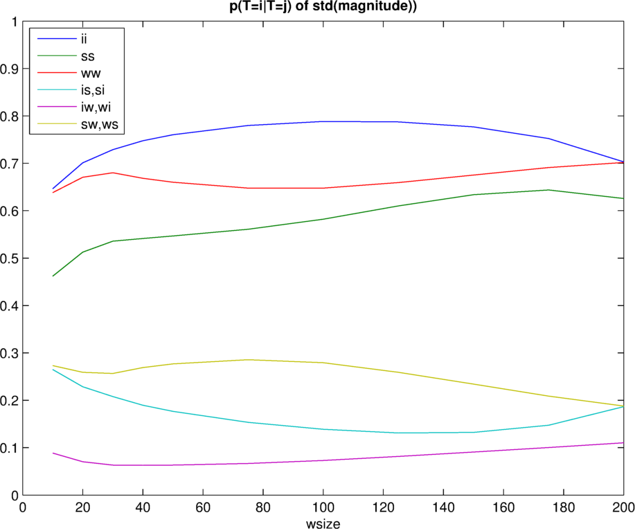
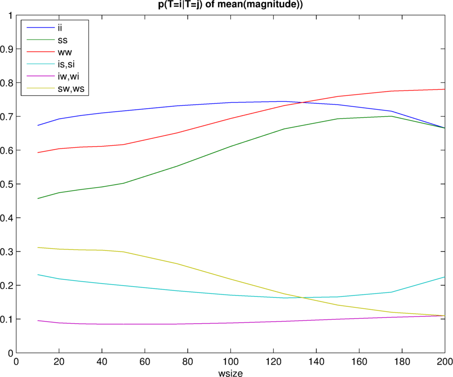
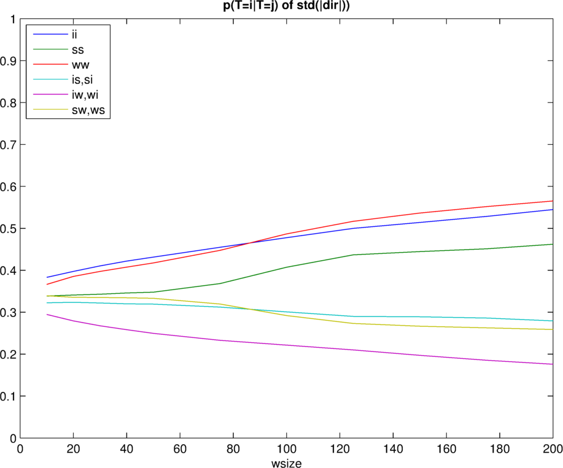
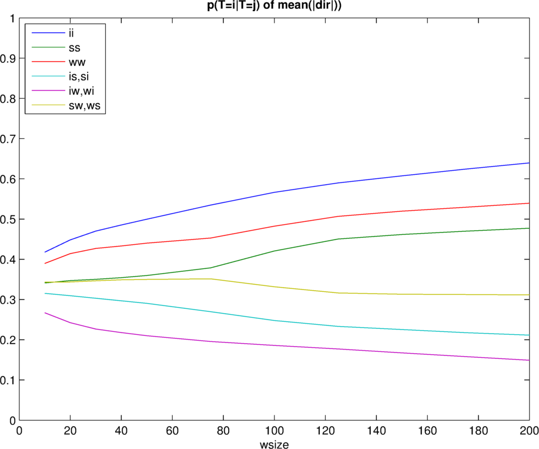
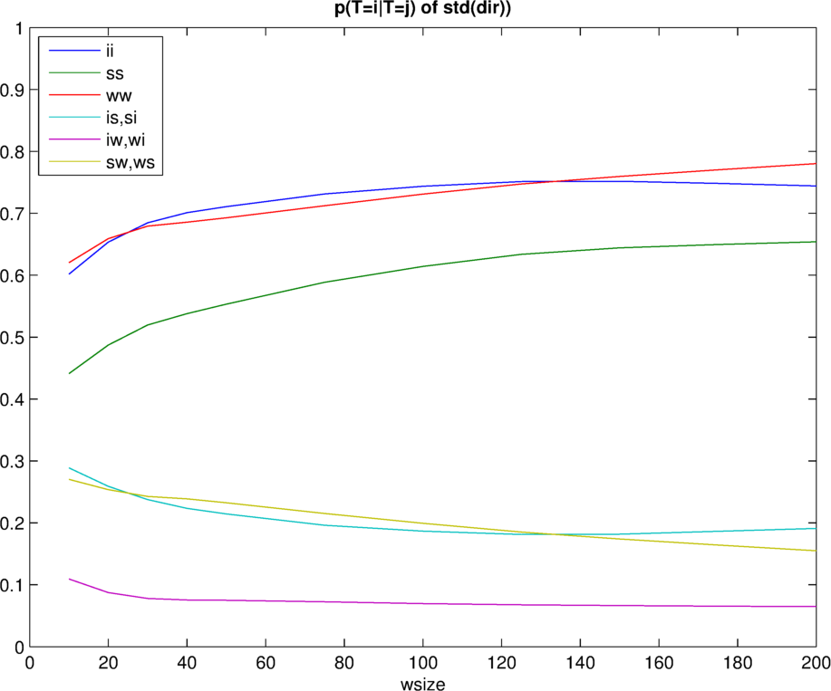
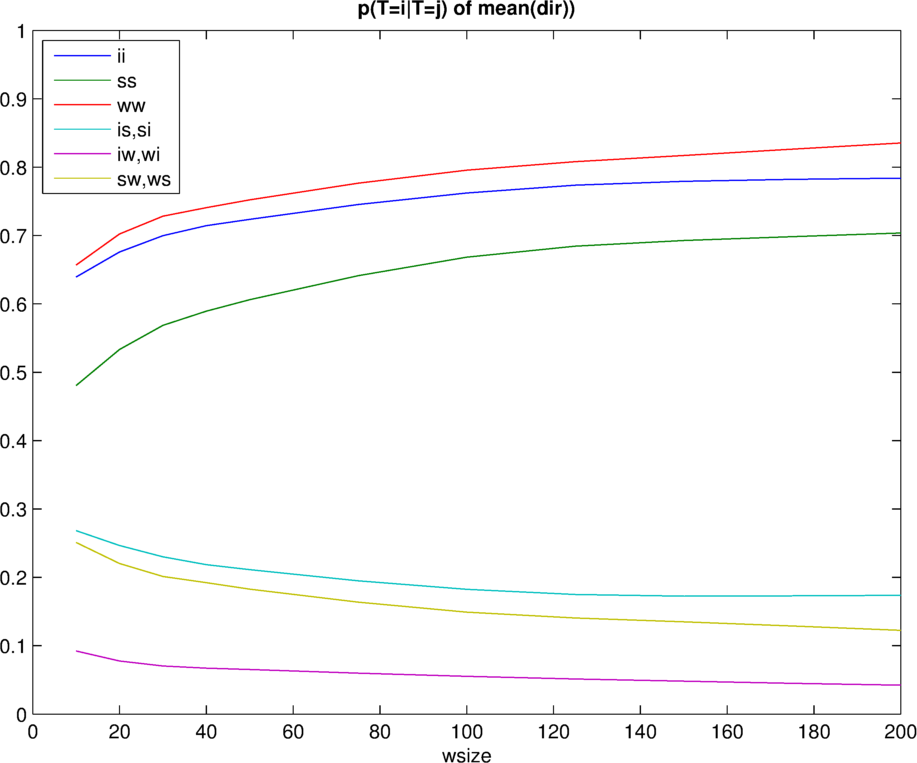

# Index:
- [Data fitting](#data-fitting)
- [Probability of (mis) classification](#probability-of-mis-classification)
- [Results](#results)
- [Conclusion](#conclusion)

# Feature selection

One of the most challenging tasks is to select the correct features. While a trail-and-error approach might give nice results, we believe a deeper understanding of the data might result in better classification. As indicated by [A. Rai et. al. ](http://research.microsoft.com/pubs/166309/com273-chintalapudi.pdf), the mean and standard deviation of a signal gives good insights of the type of motion. One important question remains: what window-size should be taken to calculate the standard deviation on? 

## Data fitting
Since we are not able to observe all possible idle-, walk- and step- motions, the generated pdfs might miss some data. To smoothen our results and overcome the issue of missing data, we do a fit on the pdf. The type of distribution of the data is unknown. In order to determine which distribution fit best, we make use of a function developed by Mike Sheppard: [`allfitdist`](http://www.mathworks.com/matlabcentral/fileexchange/34943-fit-all-valid-parametric-probability-distributions-to-data).


The `allfitdist` function tries to fit different distributions and returns a vector of the the top-7 best fits. We have tested several (11) windowsizes: 10, 20, 30, 40, 50, 75, 100, 125, 150, 175 and 200 samples, ranging from 1/5th of a second to a window of 4 seconds. 

Since a datawindow is used, a calculation on the motiontype has to be performed. The 'easiest' way af determining the motion type of a window is to assign the type of the first element of that window. This however might introduce noise, as the first sample could be 'idle', while the next 99 samples are 'walk'. Hence a majority voting is applied: the motiontype which occures the most in the datawindow is assigned to the feature. 

Each windowsize generates 3 fits, one for each activity: walking, idle and step. In total, 33 fits are generated. In the table below the cumulative top-3 fit of each sample is shown.

```
>> file = '../logs/log_accelActivity1431957054688_corrected.txt'
>> sum(motiontype==1) = 20742 % idle samples
>> sum(motiontype==3) = 9308  % walk samples
>> sum(motiontype==4) = 5715  % step samples
>> testPdfFit([10 20 30 40 50 75 100 125 150 175 200], run, motiontype, magnitude)

```

|distribution                 |  1  |  2  |  3  |
| --------------------------- | --- | --- | --- |
| generalized extreme value   |  30 |  0  |  3  |
| generalized pareto          |  3  |  18 |  36 |
| tlocationscale              |  0  |  10 |  1  |
| exponential                 |  0  |  5  |  22 |
| logistic                    |  0  |  0  |  1  |


From this, it can observed that the 'generalized extreme value'-distribution might be to correct approximation for our data. It is returned as the best fit for all samples, except for the pdf of a windowsize of 10, which probably does not contain enough samples for a good fit.

By using the matlab functions `gevfit` and `gevpdf` we can now compute the probability of (mis)classification, based on a fit of the generalized extreme value distribution.

## Probability of (mis) classification

A 'good' window-size would be a width for which the probability of correct classification is high and the probability for mis-classification is low. By discretising and normalising the pdfs, these probabilities can be calculated.

First, a vector representing the x-axis is assumed to run from 0 to some value K in steps of k, resulting in K/k values. For each x-value, the corresponding y-value of each (idle, step and walk) pdf is calculated, resulting in 3 new vectors, each K/k elements long. These 4 vectors together represent the 3 histograms of each motion-type. 

Normalisation of each histogram is needed to be able to calculate the probability of (mis) classification and is done by dividing each element in the histogram by the sum of each element, multiplied by k, or in matlab notiation:

```
% hist = [K/k x 1]-vector of y-values of a pdf, calculated for each x in 0:k:K
hist_norm = hist / sum(hist*k)
```

We are looking for the probability of (mis)classification of a motiontype `T`, that is: `P(T=i|T=j)`, where `i,j = 1,2,3`, representing the motiontypes idle(1), step(2) and walk(3). Since we use a normalised histogram of a pdf, we know that each value of the histogram represents the probability that, given motiontype `j` is picked, the corresponding x-value is measured: `P(X=x|T=j)`. For each x-value we can also calculate the probability, that given a x-value `x` is sampled, the probability that a certain motiontype `i` is observed: `P(T=i|X=x)`. Since we have discretised the histogram, multiplying the two latter probabilities, results in the first: `P(T=i|T=j) = P(T=i|X=x)*P(X=x|T=j)`. 

Eventually, we get 3x3 = 9 different probabilities:
- `P(T=1|T=1)`: The probability of correctly classifying 'idle'
- `P(T=2|T=1)`: The probability of mis-classifying 'idle' as 'step'
- `P(T=3|T=1)`: The probability of mis-classifying 'idle' as 'walk'
- `P(T=1|T=2)`: The probability of mis-classifying 'step' as 'idle'
- `P(T=2|T=2)`: The probability of correctly classifying 'step'
- `P(T=3|T=2)`: The probability of mis-classifying 'step' as 'walk'
- `P(T=1|T=3)`: The probability of mis-classifying 'walk' as 'idle'
- `P(T=2|T=3)`: The probability of mis-classifying 'walk' as 'step'
- `P(T=3|T=3)`: The probability of correctly classifying 'walk'

Ideally we want to pick a windowsize where the probability of misclassification is 0, and the probability of correct classification is 1. This might not happen, hence windowsizes for which the misclassification of a certain motiontype is low, are preferable for feature selection: e.g. a window in which the probability of misclassification of 'step' for 'idle' is low, while 'walk' for 'idle' is high, might still provide useful cues (when combined with other features) for kNN to classify 'idle' as 'idle' (or certainly, prohibit kNN to classify the sample as 'step'). 

## Results

In this section the results of different feature calculations are shown. Not all attempts are reported. 
For all tests which use a windowsize, the same windowsizes as with the fit are used: 10, 20, 30, 40, 50, 75, 100, 125, 150, 175 and 200 samples, ranging from 1/5th of a second to a window of 4 seconds. 

### Magnitude

As mentioned before, the magnitude of the accelerometer might give good insights for classification. The raw accelerometer data contains a lot of noise, hence functions such as the standard deviation and mean are applied. The next two sections show the results.

#### Standard Deviation
```
>> file = '../logs/log_accelActivity1431957054688_corrected.txt'
>> sum(motiontype==1) = 20742 % idle samples
>> sum(motiontype==3) = 9308  % walk samples
>> sum(motiontype==4) = 5715  % step samples
>> calcStdMisProb([10 20 30 40 50 75 100 125 150 175 200], 2, 0.01, run, motiontype, magnitude)
%wsize P(T=1|T=1) P(T=2|T=1) P(T=3|T=1) P(T=1|T=2) P(T=2|T=2) P(T=3|T=2) P(T=1|T=3) P(T=2|T=3) P(T=3|T=3)
10.0000    0.6463    0.2650    0.0887    0.2650    0.4619    0.2731    0.0887    0.2731    0.6381
20.0000    0.7011    0.2285    0.0704    0.2285    0.5126    0.2589    0.0704    0.2589    0.6706
30.0000    0.7289    0.2078    0.0634    0.2078    0.5357    0.2565    0.0634    0.2565    0.6801
40.0000    0.7476    0.1896    0.0627    0.1896    0.5414    0.2690    0.0627    0.2690    0.6683
50.0000    0.7603    0.1765    0.0632    0.1765    0.5467    0.2767    0.0632    0.2767    0.6601
75.0000    0.7797    0.1535    0.0668    0.1535    0.5609    0.2856    0.0668    0.2856    0.6477
100.0000    0.7882    0.1388    0.0731    0.1388    0.5820    0.2792    0.0731    0.2792    0.6477
125.0000    0.7874    0.1309    0.0817    0.1309    0.6100    0.2591    0.0817    0.2591    0.6592
150.0000    0.7769    0.1323    0.0908    0.1323    0.6336    0.2341    0.0908    0.2341    0.6751
175.0000    0.7523    0.1475    0.1002    0.1475    0.6437    0.2088    0.1002    0.2088    0.6909
200.0000    0.7030    0.1866    0.1104    0.1866    0.6257    0.1878    0.1104    0.1878    0.7018
```


#### Mean
>> file = '../logs/log_accelActivity1431957054688_corrected.txt'
>> sum(motiontype==1) = 20742 % idle samples
>> sum(motiontype==3) = 9308  % walk samples
>> sum(motiontype==4) = 5715  % step samples
>> calcMeanMisProb([10 20 30 40 50 75 100 125 150 175 200], 2, 0.01, run, motiontype, magnitude)
```
10.0000    0.6732    0.2314    0.0954    0.2314    0.4567    0.3119    0.0954    0.3119    0.5926
20.0000    0.6923    0.2190    0.0887    0.2190    0.4740    0.3070    0.0887    0.3070    0.6043
30.0000    0.7025    0.2117    0.0858    0.2117    0.4834    0.3050    0.0858    0.3050    0.6092
40.0000    0.7100    0.2051    0.0849    0.2051    0.4912    0.3038    0.0849    0.3038    0.6113
50.0000    0.7162    0.1992    0.0847    0.1992    0.5018    0.2990    0.0847    0.2990    0.6163
75.0000    0.7312    0.1837    0.0851    0.1837    0.5525    0.2638    0.0851    0.2638    0.6510
100.0000    0.7409    0.1708    0.0883    0.1708    0.6110    0.2181    0.0883    0.2181    0.6936
125.0000    0.7443    0.1624    0.0933    0.1624    0.6629    0.1747    0.0933    0.1747    0.7319
150.0000    0.7346    0.1657    0.0996    0.1657    0.6930    0.1413    0.0996    0.1413    0.7591
175.0000    0.7155    0.1794    0.1051    0.1794    0.7006    0.1200    0.1051    0.1200    0.7750
200.0000    0.6653    0.2248    0.1098    0.2248    0.6653    0.1099    0.1098    0.1099    0.7803
```


### Direction of motion
It is expected that a walk shows that de accelerometer moves into a certain diretcion, while being idle might does not show a particiluar direction over an amount of time. Given two consecutive samples, the change in direction can be computed:

```
a1 = acceldata(idx-1,:);
a2 = acceldata(idx  ,:);

%normalisze
if (normalise)
    a1 = a1 / sqrt(a1(1).^2 + a1(2).^2 + a1(3).^2);
    a2 = a2 / sqrt(a2(1).^2 + a2(2).^2 + a2(3).^2);
end

%change in direction
da = a2 - a1;
dir(end+1) = sqrt(da(1).^2 + da(2).^2 + da(3).^2);
```

From `dir` the mean and standard deviation are calculated for different windowsizes. Normalisation of both accel-measurements is also used. (a normalised change in direction would be independent in changes of speed, sololy depedending of change in the direction of motion)

#### Normalised, Standard deviation

```
>> file = '../logs/log_accelActivity1431957054688_corrected.txt'
>> [s2 m2 r2] = calcDir2(run, motiontype, accel, true);
>> sum(m2==1) = 20740
>> sum(m2==3) = 9308
>> sum(m2==4) = 5715
>> calcStdProb([10 20 30 40 50 75 100 125 150 175 200], 10, 2, 0.01, r2', m2', s2', 'head');
10.0000    0.3830    0.3223    0.2947    0.3223    0.3386    0.3391    0.2947    0.3391    0.3662
20.0000    0.3972    0.3235    0.2793    0.3235    0.3410    0.3355    0.2793    0.3355    0.3852
30.0000    0.4105    0.3220    0.2675    0.3220    0.3428    0.3352    0.2675    0.3352    0.3973
40.0000    0.4218    0.3200    0.2582    0.3200    0.3457    0.3343    0.2582    0.3343    0.4075
50.0000    0.4314    0.3192    0.2494    0.3192    0.3477    0.3331    0.2494    0.3331    0.4174
75.0000    0.4549    0.3121    0.2330    0.3121    0.3683    0.3195    0.2330    0.3195    0.4475
100.0000    0.4778    0.3008    0.2214    0.3008    0.4072    0.2920    0.2214    0.2920    0.4866
125.0000    0.4999    0.2900    0.2100    0.2900    0.4367    0.2733    0.2100    0.2733    0.5167
150.0000    0.5141    0.2889    0.1970    0.2889    0.4445    0.2666    0.1970    0.2666    0.5364
175.0000    0.5285    0.2861    0.1854    0.2861    0.4511    0.2628    0.1854    0.2628    0.5518
200.0000    0.5448    0.2791    0.1760    0.2791    0.4622    0.2587    0.1760    0.2587    0.5653
```


#### Normalised, Mean
```
>> file = '../logs/log_accelActivity1431957054688_corrected.txt'
>> [s2 m2 r2] = calcDir2(run, motiontype, accel, true);
>> sum(m2==1) = 20740
>> sum(m2==3) = 9308
>> sum(m2==4) = 5715
>> calcMeanProb([10 20 30 40 50 75 100 125 150 175 200], 10, 2, 0.01, r2', m2', s2', 'head');
10.0000    0.4178    0.3153    0.2670    0.3153    0.3413    0.3435    0.2670    0.3435    0.3896
20.0000    0.4482    0.3094    0.2424    0.3094    0.3471    0.3435    0.2424    0.3435    0.4140
30.0000    0.4702    0.3033    0.2265    0.3033    0.3503    0.3465    0.2265    0.3465    0.4270
40.0000    0.4852    0.2968    0.2179    0.2968    0.3542    0.3489    0.2179    0.3489    0.4331
50.0000    0.4996    0.2904    0.2100    0.2904    0.3597    0.3499    0.2100    0.3499    0.4400
75.0000    0.5346    0.2697    0.1957    0.2697    0.3788    0.3515    0.1957    0.3515    0.4529
100.0000    0.5663    0.2477    0.1859    0.2477    0.4206    0.3316    0.1859    0.3316    0.4824
125.0000    0.5898    0.2332    0.1770    0.2332    0.4504    0.3163    0.1770    0.3163    0.5067
150.0000    0.6074    0.2254    0.1673    0.2254    0.4615    0.3131    0.1673    0.3131    0.5196
175.0000    0.6243    0.2176    0.1581    0.2176    0.4699    0.3125    0.1581    0.3125    0.5294
200.0000    0.6395    0.2114    0.1492    0.2114    0.4773    0.3114    0.1492    0.3114    0.5395
```


#### Not normalised, Standard deviation
```
>> file = '../logs/log_accelActivity1431957054688_corrected.txt'
>> [s2 m2 r2] = calcDir2(run, motiontype, accel, false);
>> sum(m2==1) = 20740
>> sum(m2==3) = 9308
>> sum(m2==4) = 5715
>> calcStdProb([10 20 30 40 50 75 100 125 150 175 200], 10, 2, 0.01, r2', m2', s2', 'head');
10.0000    0.6018    0.2888    0.1094    0.2888    0.4410    0.2702    0.1094    0.2702    0.6204
20.0000    0.6536    0.2591    0.0873    0.2591    0.4873    0.2536    0.0873    0.2536    0.6591
30.0000    0.6846    0.2375    0.0779    0.2375    0.5197    0.2428    0.0779    0.2428    0.6794
40.0000    0.7010    0.2234    0.0755    0.2234    0.5379    0.2387    0.0755    0.2387    0.6858
50.0000    0.7108    0.2143    0.0749    0.2143    0.5533    0.2324    0.0749    0.2324    0.6927
75.0000    0.7313    0.1961    0.0726    0.1961    0.5887    0.2152    0.0726    0.2152    0.7122
100.0000    0.7438    0.1865    0.0697    0.1865    0.6142    0.1993    0.0697    0.1993    0.7309
125.0000    0.7512    0.1812    0.0676    0.1812    0.6337    0.1851    0.0676    0.1851    0.7473
150.0000    0.7517    0.1818    0.0665    0.1818    0.6443    0.1739    0.0665    0.1739    0.7596
175.0000    0.7483    0.1863    0.0655    0.1863    0.6496    0.1642    0.0655    0.1642    0.7704
200.0000    0.7441    0.1911    0.0648    0.1911    0.6540    0.1549    0.0648    0.1549    0.7803
```


#### Not normalised, Mean
```
>> file = '../logs/log_accelActivity1431957054688_corrected.txt'
>> [s2 m2 r2] = calcDir2(run, motiontype, accel, false);
>> sum(m2==1) = 20740
>> sum(m2==3) = 9308
>> sum(m2==4) = 5715
>> calcMeanProb([10 20 30 40 50 75 100 125 150 175 200], 10, 2, 0.01, r2', m2', s2', 'head');
10.0000    0.6393    0.2684    0.0923    0.2684    0.4807    0.2509    0.0923    0.2509    0.6568
20.0000    0.6759    0.2465    0.0776    0.2465    0.5333    0.2203    0.0776    0.2203    0.7022
30.0000    0.6997    0.2300    0.0703    0.2300    0.5687    0.2013    0.0703    0.2013    0.7284
40.0000    0.7143    0.2185    0.0671    0.2185    0.5894    0.1921    0.0671    0.1921    0.7407
50.0000    0.7237    0.2112    0.0651    0.2112    0.6061    0.1827    0.0651    0.1827    0.7521
75.0000    0.7453    0.1950    0.0598    0.1950    0.6413    0.1637    0.0598    0.1637    0.7765
100.0000    0.7622    0.1825    0.0552    0.1825    0.6683    0.1491    0.0552    0.1491    0.7956
125.0000    0.7737    0.1749    0.0514    0.1749    0.6844    0.1406    0.0514    0.1406    0.8079
150.0000    0.7793    0.1725    0.0482    0.1725    0.6926    0.1349    0.0482    0.1349    0.8170
175.0000    0.7821    0.1729    0.0450    0.1729    0.6983    0.1288    0.0450    0.1288    0.8262
200.0000    0.7840    0.1738    0.0422    0.1738    0.7038    0.1224    0.0422    0.1224    0.8353
```


#### Observations
From the above results, it can be observed that the normalisation of the data results in a large amount of errors: the probability of missclassifcation is high for each motion type and windowsize, compared to the non-normalised results.

Comparing the standard deviation and mean of the direction, it can be seen that (while sometimes small), the mean results in better classification, with a maximum error of 4% for `walking` and `idle`! 

Interestingly, the highest windowsize results in the best performance. (but, why?? noise reduction?)

### Autocorrelation
Detecting steps

As reported by [A. Rai et. al. ](http://research.microsoft.com/pubs/166309/com273-chintalapudi.pdf) the Normalized Auto-correlation based Step Counting (NASC) provides insight in the step frequency and hence if the person is walking. 

The NASC process can be applied to several different signals: on each axis of the accelerometer or the magnitude. 
While the latter might suppress frequencies which could be in anti-phase in different directions, the former results in 3 different NASC value for each sample. Another problem with the former is that if a single axis is chosen as feature, the model used for classification indirectly will assume that this axis always responds accordingly. This might not be the case as the user rotates his phone.
To overcome this issue, a 5th option is added: the maximum of the NASC values of each axis. 

Using resulting values, the probability of misclassification can be calculated. The assigned motiontype for a NASC value equals to annotated motiontype of the element for which the NASC-values is calculated.

Below the resulting probabilites for misclassification are shown
```
accel(:,1)   0.3717    0.3662    0.2621    0.3662    0.3819    0.2518    0.2621    0.2518    0.4861
accel(:,2)   0.4374    0.4122    0.1505    0.4122    0.4314    0.1564    0.1505    0.1564    0.6932
accel(:,3)   0.4254    0.4305    0.1441    0.4305    0.4453    0.1242    0.1441    0.1242    0.7317
max(accel)   0.4253    0.4240    0.1507    0.4240    0.4305    0.1455    0.1507    0.1455    0.7038
magnitude    0.4003    0.3629    0.2369    0.3629    0.3582    0.2789    0.2369    0.2789    0.4842
```
It can be observed that calculating the magnitude of the accelerometer and use this value to compute the NASC, might not be a good choice: in many cases it is outperformed by the individuel accelerometer computations. The maximum of the 3 NASC values of the accelerometer however does a proper job in classification. While the best axis performs slightly better, the maximum is axis independent, and hence might result in better results when the phone is held in a different orientation.

# Conclusion

Combining all data and results, features should be selected which are as expressive as possible: that is, combining features for which the combinitation is able to determine difference as accurate as possible. 

Sifting through the results, the following features are selected:

```
std(mag)   = magnitude of accel, standard deviation, wsize=125 (2.25 seconds)
mean(head) = Heading, mean, not normalised, wsize=200 (4 seconds)
      P(T=1|T=1) P(T=2|T=1) P(T=3|T=1) P(T=1|T=2) P(T=2|T=2) P(T=3|T=2) P(T=1|T=3) P(T=2|T=3) P(T=3|T=3)
std(mag)    0.7874    0.1309    0.0817    0.1309    0.6100    0.2591    0.0817    0.2591    0.6592
mean(head)  0.7840    0.1738    0.0422    0.1738    0.7038    0.1224    0.0422    0.1224    0.8353
```

Combining these features, we have a hight probability of correctly classifing the different motions:
- optimally: idle:78%, step:70%, walk:83%
while the probability of misclassificaiton is low:
- optimally: idle-step:13%, idle-walk:4%, step-walk:12%.


